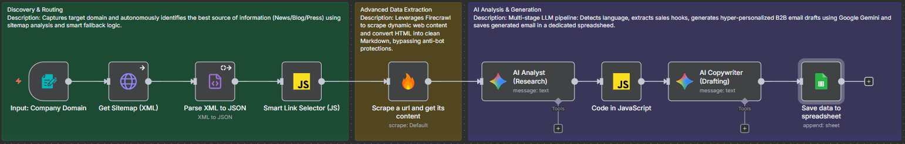

# AI-Driven B2B Lead Intelligence & Outreach Engine

An automated n8n agent designed to transform any company domain into a hyper-personalized sales pitch by analyzing real-time web data.

## Overview
This system replaces manual prospect research. It autonomously crawls company websites, extracts core value propositions, and drafts unique "hooks" for cold outreach in under 30 seconds.

## Architecture & Logic
The workflow is built modularly to ensure high-quality data extraction and natural-sounding copy:

* **Discovery Layer**: Custom JavaScript logic that identifies sitemaps and prioritizes News/Blog sections to ensure the outreach references the latest company updates.
* **Extraction Layer**: Leverages Firecrawl to bypass anti-bot measures and convert dynamic HTML into clean Markdown, optimized for LLM context windows.
* **Generation Layer**: A multi-stage Gemini 2.5 Flash pipeline that first detects the language (English/Polish, more to add in the future) and extracts sales hooks, then drafts a professional, non-spammy email in the target language.

## Tech Stack
* **Orchestration**: n8n (Modular Workflow)
* **LLM**: Google Gemini API
* **Data Extraction**: Firecrawl
* **Storage**: Google Sheets
* **Logic**: JavaScript (Custom sitemap routing & JSON sanitization)

## Security & Implementation
* **Credential Handling**: The provided workflow.json contains credential IDs only. To run this, you must link your own Gemini, Firecrawl, and Google Sheets API keys within your n8n instance.
* **Robustness**: The system includes fallback logic that reverts to homepage scraping if a sitemap is unavailable, ensuring the workflow remains resilient.
